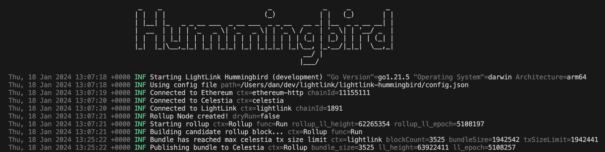

# LightLink Hummingbird


> [!NOTE]  
> Hummingbird is a work in progress and is not yet ready for production use.



Hummingbird is a light client for interacting with the [LightLink Protocol](https://lightlink.io).

It is designed to work in unison with the [hummingbird-contracts](https://github.com/lightlink-network/hummingbird-contracts) repository.

Documentation & deployed contract addresses can be found [here](https://docs.lightlink.io/lightlink-protocol/achitecture-and-design/lightlink-protocol-deep-dive).

## Usage

```bash rollup info  # Get the current rollup state
hb rollup info --num <rblock_number> --bundle # View the bundled L2 block hashes in an L1 rblock
hb rollup next  # [Publisher Only] Generate the next rollup block
hb rollup start # [Publisher Only] Start the rollup loop to generate and submit bundles
hb challenger challenge-da <rblock_number> # Challenge data availability
hb defender defend-da <rblock_hash> # Defend data availability
hb defender info-da <rblock_hash> # Provides info on an existing challenge
hb defender prove-da <rblock_hash> # Prove data availability
hb defender start # Start the defender loop to watch and defend challenges
hb defender provide --type=header <rblock_hash> <l2_block_hash> # Provide will download header for the given <l2_block_hash> from Celestia and provide it to Layer 1 ChainOracle
hb defender provide --type=tx <rblock_hash> <l2_tx_hash> # Provide will download tx for the given <l2_tx_hash> from Celestia and provide it to Layer 1 ChainOracle
```

The following root flags are available for all commands:

```bash
--config-path <path> # Path to the config file
--log-level <level> # Log level (debug, info, warn, error)
--log-format <format> # Log format (json, text)
--log-source <bool> # Log source file and line
```

## Installation

### Prerequisites

- [Golang](https://go.dev/dl/) (v1.21.5 or higher) installed. Go version can be checked with `$ go version`

### Option 1: Install from source (MacOS/Linux)

Build the binary from source:

```bash
cd $HOME
rm -rf hummingbird-client
git clone https://github.com/lightlink-network/hummingbird-client.git
cd hummingbird-client
git checkout tags/v0.1.1 -b v0.1.1
make build
```

Install the binary to your `$GOPATH/bin`:

```bash
make install
```

Check the installation was successful:

```bash
hb --help
```

Note: If your go path is not set in your system path, the binary can be run directly from the `./build` directory:

```bash
./build/hb_darwin_amd64 --help
```

### Option 2: Use pre-built binary

Download the latest release from [here](https://github.com/lightlink-network/hummingbird-client/releases)

## Configuration

Hummingbird requires a configuration file to run. A sample configuration file is provided in the repository [here](config.example.yaml). Copy this file and rename it to `config.yaml`. Then fill in the required fields.

```bash
cp config.example.yaml config.yaml
```

A single environment variable `ETH_KEY` is required to be set. This is the private key of the Ethereum account that will be used to sign transactions. This account must have sufficient funds to pay for gas fees.

```bash
export ETH_KEY=0x...
```

**Note**: configuration file `config.yaml` path can be specified with the `--config-path` flag. If not specified, the default path is `./config.yaml`

see `hb --help` for more information

<p align="center">
  
</p>
